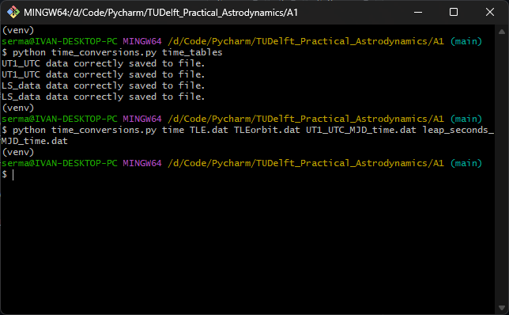

# Routines that read and download the leap-second and time correction tables 

## How it works

The time_conversions.py script provides a way to read and download the time correction tables between different time standards.

The `time_tables()` function checks whether the tables are already in your current directory and, if that is not the case, they are downloaded as a text file. Then they are processed creating additional files where only useful data is saved for post-processing purposes.

The `time()` function reads data from the TLE, the satellite propagated orbit, the UTC to UT1 table and the UTC to GPS table.

Regarding UT1-UTC the following reference is used: [FINALS2000A.daily](https://maia.usno.navy.mil/ser7/finals2000A.daily)

Regarding leap seconds the following reference is used: [TAI-UTC](https://maia.usno.navy.mil/ser7/tai-utc.dat)

## How to use

In order to use each function, go to the CLI and use the following commands:

* python time_conversions.py time_tables
* python time_conversions.py time TLE.dat TLEorbit.dat UT1_UTC_MJD_time.dat leap_seconds_MJD_time.dat

## Working example

## Data type

After running the `time_tables()` function the following files are obtained:
* UT1_UTC.dat (RAW table for UT1-UTC conversions)
* leap_seconds.dat (RAW table for UTC-GPS conversions)
* UT1_UTC_MJD_time.dat (Modified table in matrix shape with MJD and the UT1-UTC conversions)
* leap_seconds_MJD_time.dat (Modified table in matrix shape with JD and the 3 time error coefficient conversions)
